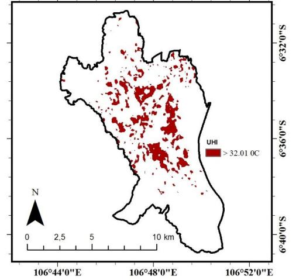

# Satellite introduction

## Landsat 8 source

.pull-left[

  Landsat 8 was launched on 11 February 2013 as a joint Earth observation satellite of the United States Geological Survey (USGS) and the National Aeronautics and Space Administration (NASA). 
  
  It is the eighth satellite in the Landsat series and is designed to continue a surface observation record that spans more than four decades.
]

.pull-right[
```{r, echo=FALSE , out.width="70%" , fig.align='center', fig.cap='(Landsat8, Source from "https://en.wikipedia.org/wiki/Landsat_8")'}

```
]


---
# OLI and TIRS introduction

Landsat 8 carries two primary sensors: 

* the Operational Land Imager (OLI)  

* the Thermal Infrared Sensor (TIRS).


### OLI:
.pull-left[
  The OLI sensor provides nine spectral bands.
  
  Including a coastal/aerosol band, three visible bands, a near-infrared band, two short-wave infrared bands, and a panoramic band with a spatial resolution of 30 m and a panoramic band of 15 m.
]
.pull-right[
```{r, echo=FALSE , out.width="90%" , fig.align='center', fig.cap='(OLI, Source from wikipedia)'}

```
]

---
# OLI and TIRS introduction

## TIRS


  The TIRS sensor provides two thermal infrared bands for surface temperature measurements with a spatial resolution of 100 m, but is typically resampled to 30 m in data processing.


```{r, echo=FALSE , out.width="50%" , fig.align='center', fig.cap='TIRS(Ali, S. A. et al., 2023)'}

```

---
# Application example 1

## Using OLI identifying Crops
Landsat-8 OLI satellite images were used as the data source, and three classification methods, namely Random Forest Classification (RFC), Support Vector Machine (SVM), and Maximum Likelihood Classification (MLC), were also combined to accurately extract the area and distribution of winter wheat cultivation in Ushi County, Xinjiang Uygur Autonomous Region(Li, X. et al., 2021).


.pull-left[
```{r, echo=FALSE , out.width="60%" , fig.align='center', fig.cap='(Landsat 8 OLI image and distribution of ground sample in study area.)'}

```
]
.pull-right[
```{r, echo=FALSE , out.width="120%" , fig.align='center', fig.cap='(Classification results by three methods based on original image.)'}

```
]

---
# Application example 2

## Using Landsat-8 OLI/TIRS to assess the Urban Heat Island (UHI)

Spatial distribution of urban heat island (UHI) in Bogor, Indonesia was assessed using thermal data (Band-10) from Landsat-8 OLI/TIRS.

.pull-left[
```{r, echo=FALSE , out.width="120%" , fig.align='center', fig.cap='(The study area: (a) Location of Bogor City to the capital of Jakarta, (b) The study area with false-colour of Landsat-8 OLI/TIRS in May 2021.)'}

```
]
.pull-right[
```{r, echo=FALSE , out.width="120%" , fig.align='center', fig.cap='(Distribution maps of (a) Normalized Difference Vegetation Index (NDVI); (b) Land Surface Temperature (LST).)'}

```
]

---
# Application example 2

## Using Landsat-8 OLI/TIRS to assess the Urban Heat Island (UHI)

Landsat 8 OLI/TIRS was successfully implemented to identify UHI by NDVI and LST extraction.

```{r, echo=FALSE , out.width="40%" , fig.align='center', fig.cap='(UHI distribution)'}

```
---
# Conclusion amd Future perspectives
## Conclusion
* The broad spectral coverage of OLI allows for detailed analyses of land and coastal areas, vegetation health, water bodies, and atmospheric conditions.

* The two thermal bands of TIRS help measure Earth's surface temperature, which is important for agriculture (assessing crop health and irrigation needs), water resource management, and understanding urban heat island effects.

## Future perspectives

The integration of OLI and TIRS data with data from other sources, such as drones, ground sensors, and future satellite missions, will likely enhance the resolution and accuracy of Earth observations. Furthermore, advancements in data processing, machine learning, and artificial intelligence will enable more sophisticated analysis and predictive modeling, expanding the potential applications of Landsat data in addressing global environmental and societal challenges.

---
# Conclusion amd Future perspectives

Possible future applications of OLI and TIRS data in different fields:

* Climate change monitoring: Continuous observation of changes in the Earth's surface and temperature variations can provide valuable insights into the impacts of climate change, contributing to climate modelling and mitigation strategies.


* Agricultural management: Enhanced monitoring of crop health, soil moisture and irrigation practices can lead to more sustainable and efficient agricultural practices.


* Disaster response and management: Rapid assessment of areas affected by natural disasters such as floods, fires and hurricanes can improve response strategies and mitigate impacts.


* Urban planning: Data on urban sprawl, green spaces and heat islands can inform smarter, more sustainable urban planning decisions.


* Water management: Better understanding of surface water distribution, snowpack levels and evapotranspiration rates can inform water conservation strategies and policies

---
# Reference

U.S. Geological Survey, 2023. Landsat 8. Available at: https://www.usgs.gov/landsat-missions/landsat-8 [Accessed 4 February 2024].

Wikipedia contributors, 2023. Landsat 8. Wikipedia. Available at: https://en.wikipedia.org/wiki/Landsat_8 [Accessed 4 February 2024].

Li, X. et al. (2021) APPLICATION OF RANDOM FOREST IN IDENTIFYING WINTER WHEAT USING LANDSAT8 IMAGERY. Engenharia agrícola. [Online] 41 (6), 619–633.

Karyati, N. E. et al. (2022) Application of Landsat-8 OLI/TIRS to assess the Urban Heat Island (UHI). IOP conference series. Earth and environmental science. [Online] 1109 (1), 012069-.

Ali, S. A. et al. (2023) Retrieval of Land Surface Temperature from Landsat 8 OLI and TIRS: A Comparative Analysis Between Radiative Transfer Equation-Based Method and Split-Window Algorithm. Remote Sensing in Earth Systems Sciences. [Online] 6 (1–2), 1–21.
